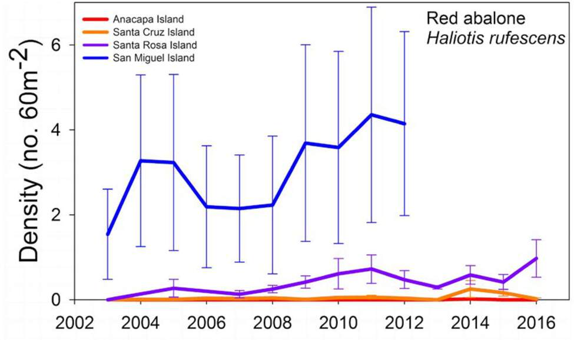
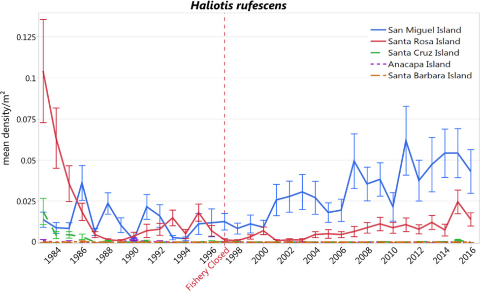
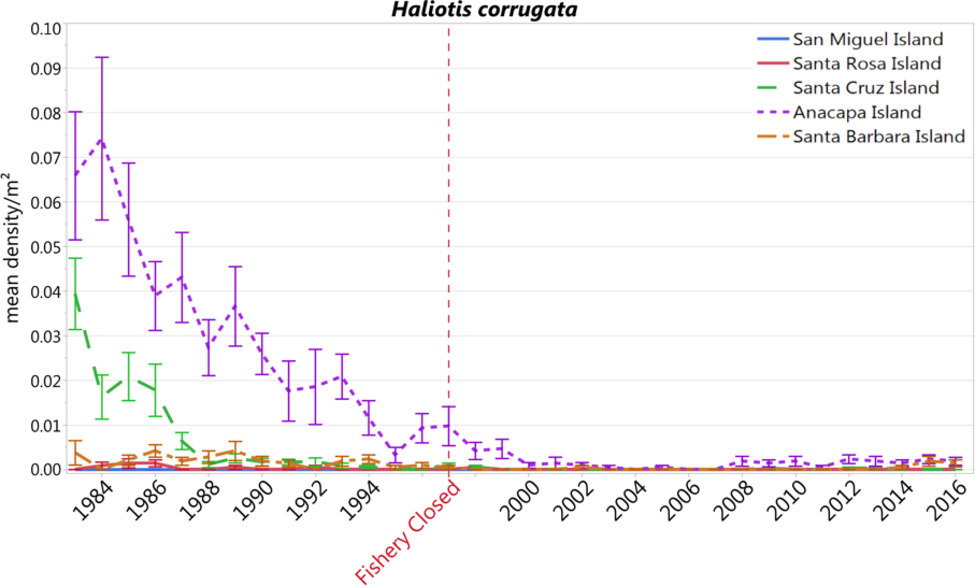

---
output:
  html_document:
    keep_md: yes
---

<!--html_preserve-->

Once readily abundant in kelp forest on rocky reefs, these snail-like marine grazers have been overfished for their meat and beautiful shells. Now, conservation efforts are trying to bring back many species on the brink of extinction.

<a href="https://sanctuarysimon.org/dbtools/species-database/id/120/haliotis/rufescens/red-abalone" target="_blank">
<i class="fa fa-info-circle"></i>
</a>
<a href="https://sanctuarysimon.org/dbtools/species-database/id/120/haliotis/rufescens/red-abalone#images" target="_blank">
<i class="fa fa-camera"></i>
</a>

<!--/html_preserve-->

## {.tabset}

### Red abalone (PISCO)

<a href="https://sanctuarysimon.org/dbtools/project-database/index.php?ID=100465" target="_blank"><i class="fa fa-clipboard-list"></i>
        PISCO Kelp Forest Monitoring</a>

<a href="http://www.piscoweb.org/access-data" target="_blank"><i class="fa fa-database"></i>
        PISCO data</a>

  
Click for Details

Average density (+/- standard error) of red abalone (*Haliotis rufescens*) at 14 sites across four islands in Channel Islands National Marine Sanctuary monitored by the <a href='http://www.piscoweb.org/kelp-forest-sampling-protocols' target='_blank'>PISCO</a> kelp forest monitoring program from 2003-2016. Abalone are counted by SCUBA divers swimming along transect lines. Observed density was averaged across all monitoring sites at each island, including sites located inside and outside of marine reserves and conservation areas, to examine course-scale trends by island. Observed density was higher at San Miguel Island (blue). For more information, consult Figure App.F.13.9 in the [CINMS 2016 Condition Report](https://nmssanctuaries.blob.core.windows.net/sanctuaries-prod/media/docs/2016-condition-report-channel-islands-nms.pdf){target="_blank"}.

### Red abalone (CHIS)

<a href="https://sanctuarysimon.org/dbtools/project-database/index.php?ID=100505" target="_blank"><i class="fa fa-clipboard-list"></i>
        CHIS Kelp Forest Monitoring</a>

<a href="https://www.nps.gov/im/medn/kelp-forest-communities.htm" target="_blank"><i class="fa fa-database"></i>
        CHIS data</a>

  
Click for Details

Average density of red abalone (*Haliotis rufescens*) at Channel Islands National Park kelp forest monitoring sites at the five islands in Channel Islands National Marine Sanctuary. Abundance of both species was greatly reduced by harvest at all islands prior to the fishery closure in 1997. A gradual increasing trend in abundance of red abalone has been observed since the fishery closure at San Miguel (blue) and more recently at Santa Rosa (red) islands. Abalone are counted by SCUBA divers and observed density was averaged across all monitoring sites at each island, including sites located inside and outside of marine reserves and conservation areas, to examine course-scale trends by island. For more information, consult Figure App.F.13.10a in the [CINMS 2016 Condition Report](https://nmssanctuaries.blob.core.windows.net/sanctuaries-prod/media/docs/2016-condition-report-channel-islands-nms.pdf){target="_blank"}.

### Pink abalone (CHIS)

<a href="https://sanctuarysimon.org/dbtools/project-database/index.php?ID=100505" target="_blank"><i class="fa fa-clipboard-list"></i>
        CHIS Kelp Forest Monitoring</a>

<a href="https://www.nps.gov/im/medn/kelp-forest-communities.htm" target="_blank"><i class="fa fa-database"></i>
        CHIS data</a>

  
Click for Details

Average density of pink abalone (*H. corrugata*) at Channel Islands National Park kelp forest monitoring sites at the five islands in Channel Islands National Marine Sanctuary. Abundance of both species was greatly reduced by harvest at all islands prior to the fishery closure in 1997. A gradual increasing trend in abundance of red abalone has been observed since the fishery closure at San Miguel (blue) and more recently at Santa Rosa (red) islands. Abalone are counted by SCUBA divers and observed density was averaged across all monitoring sites at each island, including sites located inside and outside of marine reserves and conservation areas, to examine course-scale trends by island. For more information, consult Figure App.F.13.10b in the [CINMS 2016 Condition Report](https://nmssanctuaries.blob.core.windows.net/sanctuaries-prod/media/docs/2016-condition-report-channel-islands-nms.pdf){target="_blank"}.

